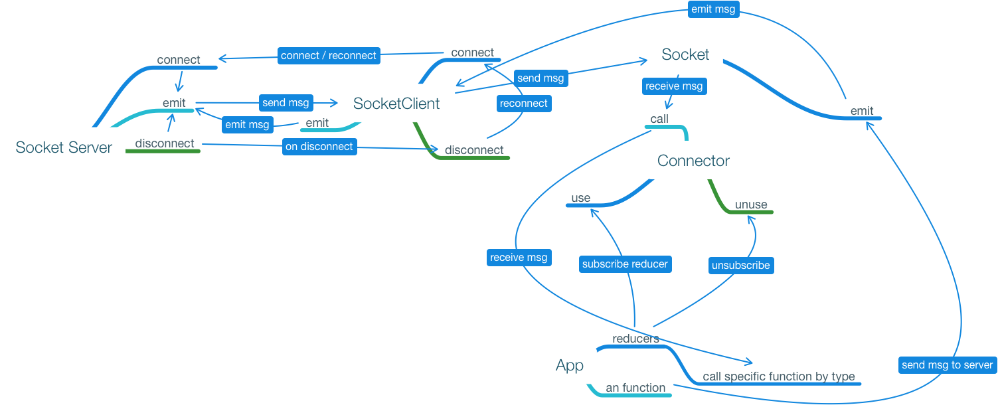

# Client-side Socket middleware

The motivation, make core abstraction that allow us put the socket as core standalone service inside app. And provide tiny api to connect from different part of app. Without any pain and confusion.

Secondary case - left possibility to debug data stream and validate data comming from socket-server to the app.

**The diagramm may looks like that**



## The limitations

Server should put all user connections to the one room. And separate all users by rooms. The globall messages are not allowed. Server should send even global message to the specific group depends on user permissions.

Other vice we have take in mind global and private messages, separate client logic and handlers, but it easier have only private messages. Front-end doesn't care about rooms on serverside only on bussines logic.

Even we are going to create chat, it would be cross rooms communications depens on IDs we sent to the server.

## Connector

The core feature is to create pull of reducers, form different part of app. That can be simple state machine. That call specific callback depends on type.

Sure we can use `EventAggregator` from the `Aurelia` but it can provide strange hard fixin bugs in future. And code become more complicated to read.

**example of reducer**

```js
const otherOneReducer = (type, data) => {
    switch (type) {
        case consts.MSG_ON_DISCONNECT: {
            console.log('F*ck, socket is disconnected');
        }

        // place for other actions
    }
}
```

The `connector` can be replaced with `redux.js` without any pain.

Methods:

- use - used for join reducers to pull. Similar like `gulp` or `express.js` do.
- unuse - possibility to remove reducers, for example when we dettach app module.
- call - send message to each reducers, we have in pull.

## Socket

The `socket.io` or other `socketjs` library wrapper. That abstractions needs to hide `connector` and solve socket connect / disconnect issues.

Else it extends the code with default events such as `MSG_ON_CONNECT` and `MSG_ON_DISCONNECT`. To be able show user somehow state of connection and be able easy to debug.

**consts.js**

```js
export const MSG_DATA_CHANGE = "msg";
export const MSG_DEFAULT_TYPE = "msg:default";
export const MSG_ON_DISCONNECT = "msg:disconnect";
export const MSG_ON_CONNECT = "msg:connect";
export const SOCKET_URL = "ws://something:9000";
```

That file is like `config.js`, can be overrided by server shide shell script.

So the `sockets.js` depends on `consts.js` and `connector.js`. And provide abstraction around the `socket.io-client`.

**usage example - in aurelia**

```js
import socket from './socket';
import { PermissionsRegistry } from '~/some_path';
import { RoutesFactory } from '~/some_path';

export function registerAppPlugins({
    aurelia, 
    plugins, 
    routesFactory, 
    permissionsRegistry
}) {
    plugins.forEach(name => {
        aurelia.use.plugin(name, config => {
            if (config.routes)
                routesFactory.registerRoutes(name, config.routes);
            
            if (config.permissions)
                permissionsRegistry.registerPermissions(Object.keys(config.permissions));
            
            if (config.socketReducers)
                socket.use(config.socketReducers);
        });
    });
}

export function configure(aurelia) {
    let routesFactory = aurelia.container.get(RoutesFactory);
    let permissionsRegistry = aurelia.container.get(PermissionsRegistry);
    let plugins = ['./some-module', ...any];

    registerAppPlugins({
        aurelia, 
        plugins, 
        routesFactory, 
        permissionsRegistry
    });

    socket.connect();
}
```

It may looks complicated, cause the abstraction around the module code. Let's play with just `socket` code.

**general example**

```js
import socket from './socket';
import { consts } from './socket';

const someReducer = (type, data) => {
    switch (type) {
        case consts.MSG_ON_CONNECT: {
            console.log('Yahooo, socket is connected');
        }

        // place for other actions
    }
}

const otherOneReducer = (type, data) => {
    switch (type) {
        case consts.MSG_ON_DISCONNECT: {
            console.log('F*ck, socket is disconnected');
        }

        // place for other actions
    }
}

// To connect use one of
socket.use(someReducer);
socket.use(otherOneReducer);

// or

socket.use([someReducer, otherOneReducer]);

// or
socket.use(someReducer, otherOneReducer);

socket.connect({
    // place for params
});

// at last, when app done.
socket.disconnect(true);
```

Methods:

- connect - init the socket connection, can be used for reconnection, possible to set the `params` to override default settings. All list of available options are [https://github.com/socketio/engine.io-client#methods](here)
- disconnect - remove the socket connection object, have to set **true** param. To forse disconnection and stop reconnect logic.
- emit - the alias for emit of socket io. Not sure but it may be usable send each emit the user cookie token or ID, to Identify somehow the message on serverside.
- use - the alias for `connector.use`
- unuse - the alias for `connector.unuse`

## Source code

Cause it just code sample it can't be tested as an library, i.e. - install and play. It alse may not work, cause it never been tested. It pseudo-code, I use to show ideas to you.

**connector.js**

```js
const reducers = [];

const use = () => {
    let args = Array.from(arguments);

    args.forEach(item => {
        if (Array.isArray(item)) {
            item.forEach(e => reducers.push(e));
        } else {
            reducers.push(item);
        }
    });
}

const unuse = (reducer) => {
    let index = reducers.indexOf(reducer);
    
    if (index) {
        reducers.splice(index, 1);
    }
}

const call = (type, data) => {
    reducers.forEach(reducer => {
        reducer(type, data);
    });
}

export default {
    call,
    use,
    unuse
}
```

The `socket` file more complicated cause we have to build recconection logic and transform Object we receive from server to {type, ...data}, cause it easy to use.

**socket.js**

```js
import io from 'socket.io-client';

import connector from './connectror';
import * as consts from './consts';

const proxyCall = (msg, data) => {
    // place for log socket call stack
    let type = null;
    
    // sadly we have to normalize arguments
    if (typeof msg === "string") {
        type = msg;
    } 
    else {
        ({ type = consts.MSG_DEFAULT_TYPE, ...data } = msg);
    }

    connector.call(type, data)
}

const onConnect = (socket) => {
    // place for subscriptions
    proxyCall(consts.MSG_ON_CONNECT);

    socket.on(consts.MSG_DATA_CHANGE, proxyCall);
}

const onDisconnect = (reason) => {
    if (this.socket.io.connecting.indexOf(this.socket) === -1) {
        // you should renew token or do another important things before reconnecting
        proxyCall(consts.MSG_ON_DISCONNECT, reason);

        // maybe we doesn't need it.
        if (!this.forseStop) { 
            this.socket.connect();
        }
    }
}

const connect = (params) => {
    // place for settings
    disconnect();

    this.socket = io.connect(consts.SOCKET_URL, Object.assign({
        usePeerConnection: true,
        reconnection: true,
        reconnectionDelay: 1000,
        reconnectionDelayMax: 5000,
        reconnectionAttempts: 99999
    }, params));


    this.socket.on('connect', onConnect);
    this.socket.on('disconnect', onDisconnect);
}

const disconnect = (forseStop) => {
    this.forseStop = forseStop;

    if (this.socket) {
        this.socket.disconnect(true);
        this.socket.destroy();

        delete this.socket;
        this.socket = null;
    }
}

const emit = (type, data)=> {
    // needs to log here all outputs
    this.socket.emit(type, data);
}

export {
    connector,
    consts
}

export default {
    connect,
    disconnect,
    emit,
    use: connector.use,
    unuse: connector.unuse,
}
```

At last. Anyway we have to use some consts. It sadly to me, but it's impossible to avoid them right now.

**consts.js**

```js
// range of defined consts
export const MSG_DATA_CHANGE = "msg";
export const MSG_DEFAULT_TYPE = "msg:default";
export const MSG_ON_DISCONNECT = "msg:disconnect";
export const MSG_ON_CONNECT = "msg:connect";
export const SOCKET_URL = "ws://something:9000";
```

At last all code available in source dirictory same as examples.

